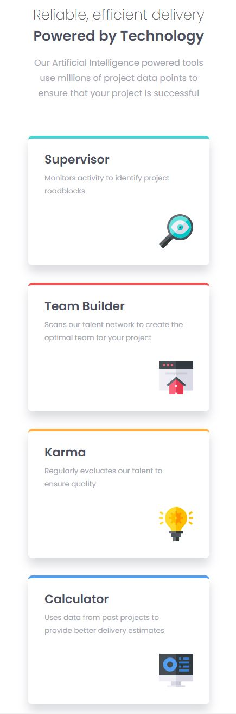
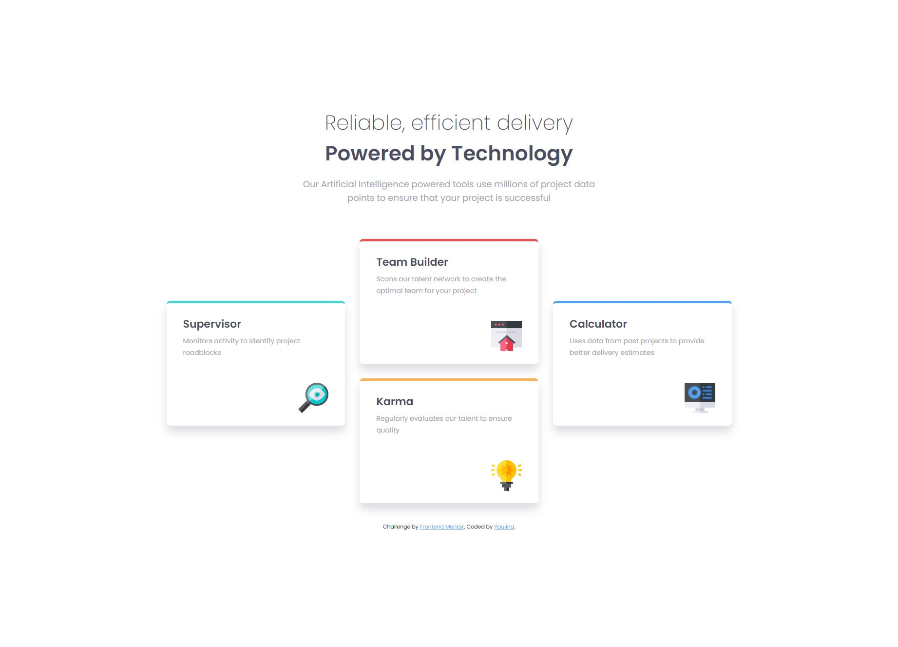

# Frontend Mentor - Four card feature section solution

This is a solution to the [Four card feature section challenge on Frontend Mentor](https://www.frontendmentor.io/challenges/four-card-feature-section-weK1eFYK).

## Table of contents

- [Overview](#overview)
  - [The challenge](#the-challenge)
  - [Screenshots](#screenshots)
  - [Link](#link)
- [My process](#my-process)
  - [Design](#design)
  - [Development](#development)
  - [Built with](#built-with)
  - [What I learned](#what-i-learned)

## Overview

### The challenge

Users should be able to:

- View the optimal layout for the site depending on their device's screen size

### Screenshots

### Link

- Live Site URL: [Add live site URL here](https://your-live-site-url.com)

## My process

### Design

I was provided with a design for this project from Frontend Mentor. The webpage is designed to be responsive, with different layouts for mobile and desktop viewports. On mobile, each tool is presented in a vertical list. On desktop, the tools are shown in a grid.

### Development

The page was developed with HTML and CSS. Semantic HTML5 elements such as main, section, footer were used for better accessibility and SEO. CSS custom properties were used to maintain the color scheme and typography consistency across the page.

### Built with

- Semantic HTML5 markup
- CSS custom properties
- Flexbox
- CSS Grid
- Mobile-first workflow

### What I learned
Through this project, I strenghten my responsive design skills using Flexbox and CSS Grid. Moreover, I practiced creating scalable, maintainable stylesheets using CSS custom properties for elements like colors and font sizes.

